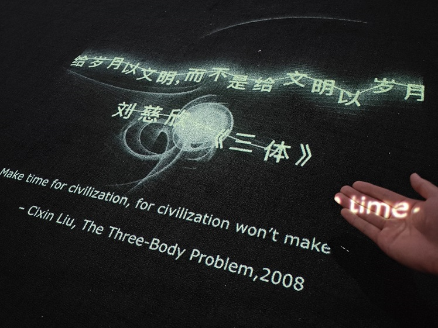

🚧内容施工中🚧

## 项目介绍

An interesting guide to learn Godot Engine🎉. 

有趣的 Godot Engine 学习指南。

### 背景

自从去年 9 月 unity 事件以来，Godot 引擎获得了很高的热度，吸引了大量新人的加入。但互联网上中文资料的匮乏，造成了较高的学习成本。大家无法快速构建出游戏原型，真的很可惜。

### 目标

输出尽可能多的**好玩**、**有创意**、**通俗易懂**和**成体系**的内容。

### 结尾

> Don't try to add more years to your life. Better add more life to your years.
>
> 🌏更加勇敢地去生活，去探索人生的更多可能性！